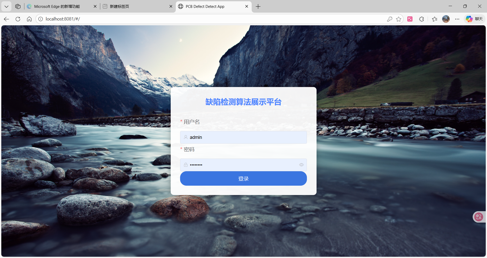
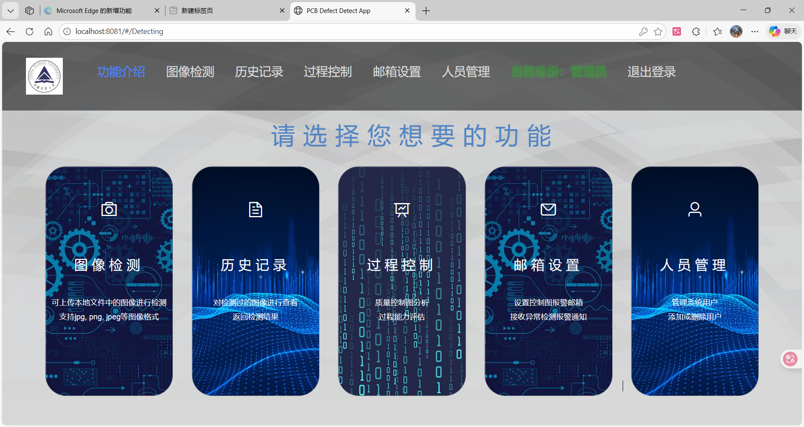
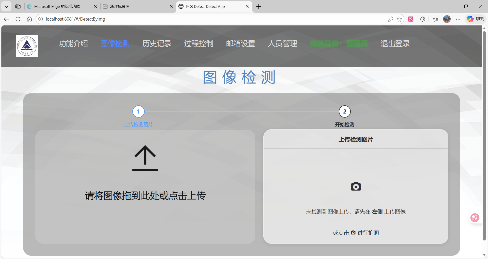
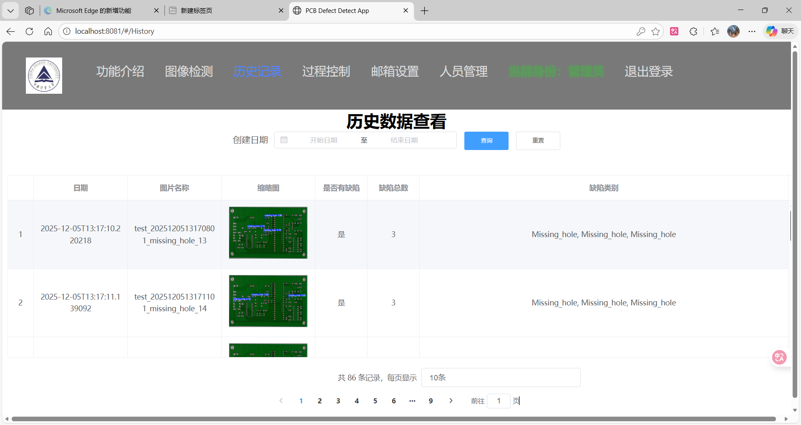
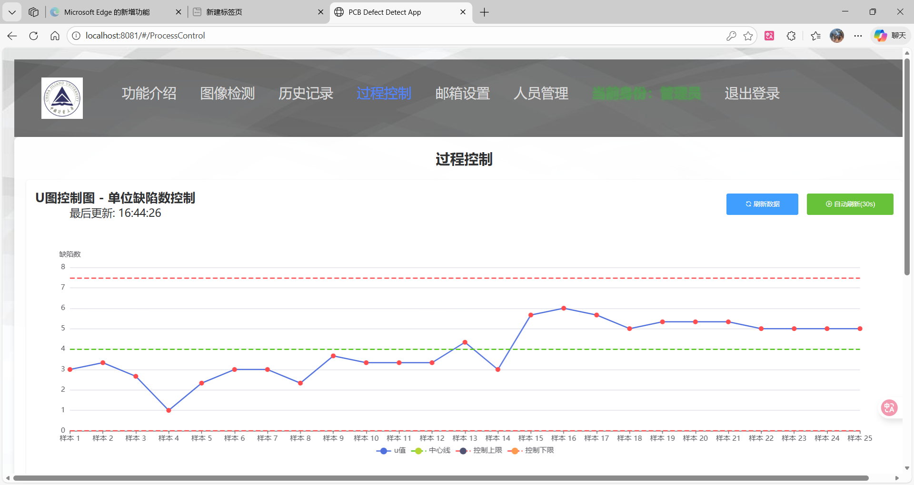
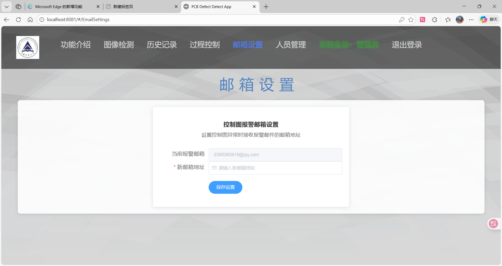
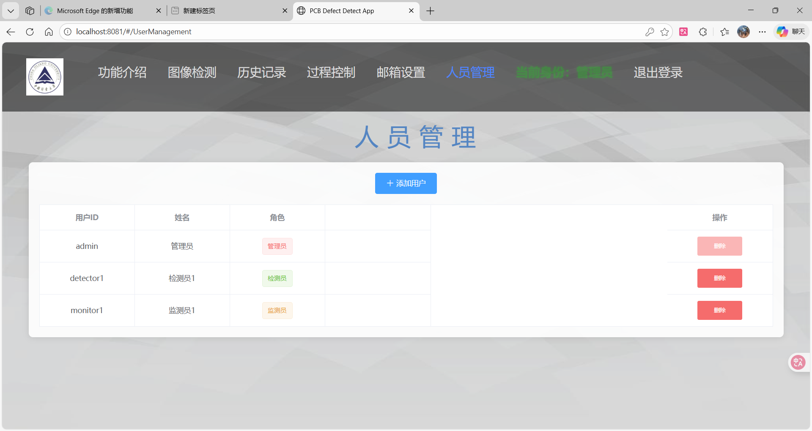
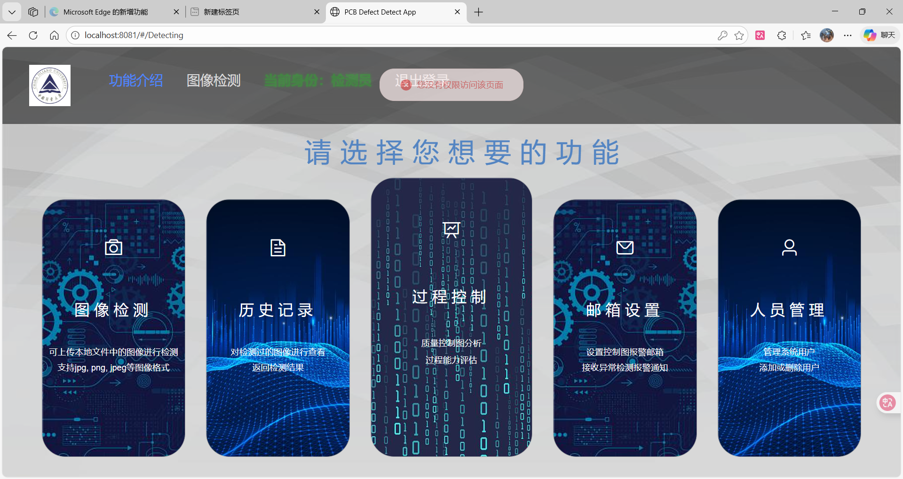
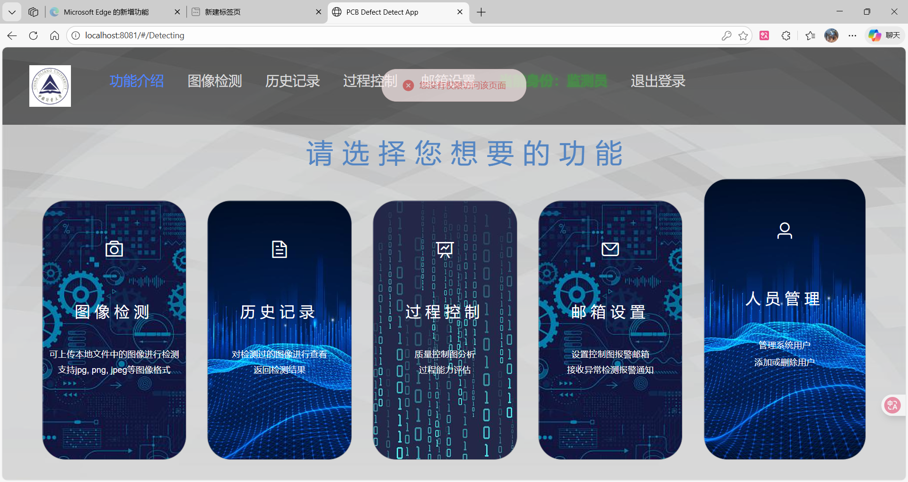

# 质量信息系统--课程设计

一个基于 Flask + Vue 的PCB缺陷检测与质量信息系统，包含图片缺陷检测、控制图分析、异常报警等功能。

本项目基于 [YOLOv8-model-improvement](https://github.com/Zwc2003/YOLOv8-model-improvement) 项目进行二次开发。

## 项目结构

```
├── back_end/      # Flask 后端
│   ├── dataset_split/  # 数据集分割
│   ├── functions/      # 功能模块
│   └── static/         # 静态文件
├── front_end/     # Vue 前端
├── email_test.py  # 邮件测试脚本
├── LICENSE
└── README.md
```

## 技术栈

### 后端 (back_end/)
- Flask 2.x - Python Web 框架
- OpenCV 4.x - 图像处理
- SQLAlchemy - 数据库管理
- YOLOv8 - 缺陷检测模型
- SQLite - 轻量级数据库

### 前端 (front_end/)
- Vue 2.x - JavaScript 框架
- Vuex 3.x - 状态管理
- Vue Router 3.x - 路由管理
- Element UI - UI 组件库

## 功能特性

1. **PCB缺陷检测**
   - 图片上传与检测
   - 缺陷类型识别
   - 检测结果可视化
   - 历史检测记录查询

2. **数据采集与管理**
   - 质量数据录入
   - 历史数据查询

3. **控制图分析**
   - U图控制图绘制
   - 实时数据监控
   - 8种异常检测规则
   - 异常自动报警

4. **异常报警**
   - 邮件通知
   - 异常类型识别

## 界面展示

系统包含以下主要界面：

1. **首页** - 系统概览和功能入口
2. **图片检测** - 上传PCB图片进行缺陷检测
3. **检测结果** - 展示检测结果和缺陷信息
4. **历史记录** - 查询和管理历史检测记录
5. **控制图分析** - 生成和展示U图控制图
6. **报警设置** - 配置邮件报警参数

以下是系统界面截图：
管理员







检验员界面

监测员界面


## 安装与运行

### 系统要求

- Python 3.8+
- Node.js 18+
- npm 8+

### 后端安装与运行

```bash
# 进入后端目录
cd back_end

# 安装依赖
pip install -r requirements.txt

# 运行后端服务
python app.py
```

后端服务将在 `http://localhost:5000` 上运行。

### 前端安装与运行

```bash
# 进入前端目录
cd front_end

# 安装依赖
npm install

# 运行前端开发服务
npm run dev
```

前端服务将在 `http://localhost:8080` 上运行。

## 配置说明

### 后端配置

- `app.py` - 主应用文件，包含 API 路由和数据库配置
- `functions/detect_img.py` - 图片检测函数，使用 YOLOv8 模型
- `functions/control_chart.py` - 控制图生成函数，实现 U 图分析
- `functions/email_utils.py` - 邮件发送工具，用于异常报警
- `static/` - 静态文件目录，存放检测结果
- `images/` - 临时图片存储目录

### 前端配置

- `config/index.js` - Vue 项目配置，包含代理设置
- `src/main.js` - 应用入口文件
- `src/components/` - Vue 组件，封装公共功能
- `src/views/` - 页面视图，实现不同功能模块
- `src/store/` - Vuex 状态管理
- `src/router/` - Vue Router 路由配置

## 控制图异常检测规则

1. 点超出 3σ 控制线
2. 连续 7 点在中心线同侧
3. 连续 6 点递增或递减
4. 连续 14 点相邻点上下交替
5. 连续 3 点中有 2 点在 2σ 控制线外
6. 连续 5 点中有 4 点在 1σ 控制线外
7. 连续 15 点在 1σ 控制线内
8. 连续 8 点在中心线两侧且无 1 点在 1σ 控制线内

## 邮件报警配置

在 `back_end/functions/email_utils1.py` 中配置邮件服务器信息：

```python
# 修改以下邮件配置信息
smtp_server = 'smtp.qq.com'
smtp_port = 465
sender_email = 'your_email@qq.com'
password = 'your_email_password'  # 替换为真实授权码
```

**注意：** 修改好后请将文件名改为 `email_utils.py`

## 开发与部署

### 开发环境

- Python 3.8+
- Node.js 18+
- npm 8+

### 生产部署

1. 构建前端项目
   ```bash
   cd front_end
   npm run build
   ```

2. 部署后端服务（可使用 Gunicorn、uWSGI 等）
   ```bash
   gunicorn -w 4 -b 0.0.0.0:5000 app:app
   ```

## 许可证

GNU GPL v3 License

## 联系方式

自己去发现
